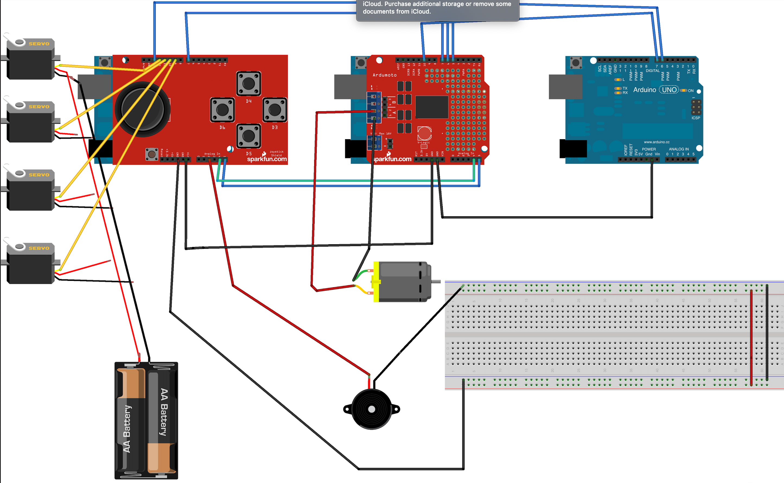

# :muscle: arduino-robotic-arm
Historical find containing code for the development of a robotic arm with CMUCam4 and joistic ps3 for the maturity exam (2013).

the arm can work in manual mode with the playstation 3 joistic or in automatic mode. for the latter mode, the arm will follow a red object.

 Here the [link](https://www.youtube.com/watch?v=7XYRb39V3yA) to the video.

## :electric_plug: Electrical Diagram

